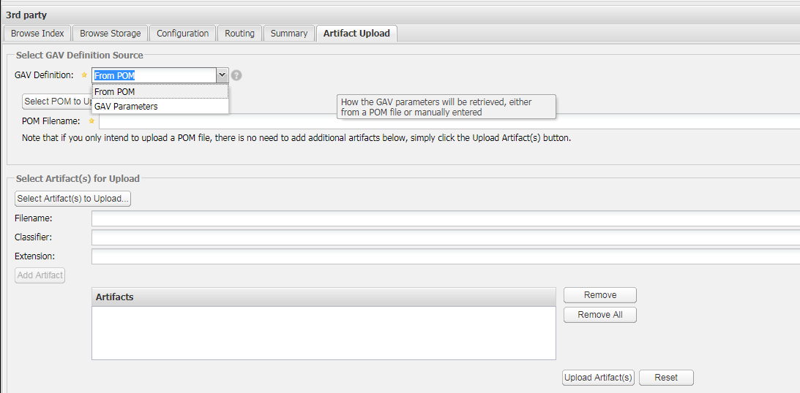

# maven 基础

## 命令行运行
### 编译
exec:java 不会自动编译代码，需要手动编译
```
mvn compile
```

### 执行

- 指定 mainClass

  ```
  mvn exec:java -Dexec.mainClass="com.vineetmanohar.module.Main"
  ```

- 传递参数

  ```
  mvn exec:java -Dexec.mainClass="com.vineetmanohar.module.Main" -Dexec.args="arg0 arg1 arg2"
  ```

- 指定 classpath

  ```
  mvn exec:java -Dexec.mainClass="com.vineetmanohar.module.Main" -Dexec.classpathScope=runtime
  ```

## maven Resources
maven 默认 resources 文件夹下的内容会编译到 classpath 下。但是，在 pom.xml 中配置 resources 节点后，resources 就不会自动编译到 classpath 下。

## settings.xml

settings.xml 用于存放 maven 配置信息，位置:

- mavneHome/conf/settings.xml ，全局位置
- ~/.m2/settings.xml，用户位置，如果存在，上面的文件不起作用。


## maven 镜像配置

在 mavenHome/conf 文件夹下有个 settings.xml 通过 mirrors 节点配置镜像，可以配置多个。

```xml
<mirrors>
  <mirror>
    <id>alimaven</id>
    <name>aliyun maven</name>
    <url>http://maven.aliyun.com/nexus/content/groups/public/</url>
    <mirrorOf>central</mirrorOf>
  </mirror>
  <mirror>
    <id>nexus</id>
    <mirrorOf>*</mirrorOf>
    <name>Local Repository</name>
    <url>http://192.168.1.6:8081/nexus/content/groups/public</url>
  </mirror>
  <mirror>
    <id>nexus</id>
    <mirrorOf>*</mirrorOf>
    <name>Local Repository</name>
    <url>http://106.14.186.157:10081/nexus/content/groups/public</url>
  </mirror>
</mirrors>
```
## snapshot and release

### 正式版本

- 如果依赖一个库的正式版本，构建的时候会在本地仓库中查找是否有依赖，如果没有才去拉取。
- 如果修改了代码但是还是发布到同一个版本，本地仓库不会更新，只能删除本地的版本进行更新。
- 或者将更新发布到新的版本中，在依赖时依赖新的版本库。

### 快照版本

如果依赖快照版本，每次编译时，会优先去远程仓库中查看是否有最新的版本，如果有就下载下来使用。

## 私服 nexus 上传 jar 包

### 通过 nexus 管理界面发布 jar 包

只能发布正式版 jar 包

- 登录 nexus
- 选中 3rd party 通过 Artifact Upload 选项上传 jar 包


- GAV Defination 有两种形式 From POM 与 GAV Parmeters 。

  如果 jar 包不依赖其他 jar 包，可以选择 GAV Parmeters 。
  如果 jar 包依赖其他 jar 包，只能选择 From POM ，否则 maven 不能自动解决依赖。

### maven 配置发布 jar 包

如果要发布 snapshot 到 nexus ，只能通过 maven deploy 发布。

- setting.xml 配置私服用户名，密码
```xml
<servers>
  <server>
    <id>sheismylife</id>
    <username>deployment</username>
    <password>your_pwd</password>
  </server>
</servers>
```

- pom.xml 配置私服地址
```xml
<distributionManagement>
  <repository>
    <id>sheismylife</id>
    <url>http://S1:8081/nexus/content/repositories/sheismylife</url>
  </repository>
</distributionManagement>
```

## maven 打包源码到 jar 包

```xml
<plugin>
    <groupId>org.apache.maven.plugins</groupId>
    <artifactId>maven-source-plugin</artifactId>
    <executions>
        <execution>
            <id>attach-sources</id>
            <goals>
                <goal>jar</goal>
            </goals>
        </execution>
    </executions>
</plugin>
```

## 参考链接
- [使用 Maven 运行 Java main 的 3 种方式](http://www.tuicool.com/articles/UJJvim)
- [maven 中 snapshot 快照库和 release 发布库的区别和作用](http://www.cnblogs.com/wangf-keep/p/6424009.html)
- [maven/gradle 打包后自动上传到nexus仓库](http://www.cnblogs.com/yjmyzz/p/auto-upload-artifact-to-nexus.html)
- [Maven 简介（一）—— Maven 的安装和 settings.xml 的配置](http://blog.csdn.net/achuo/article/details/48651435)
